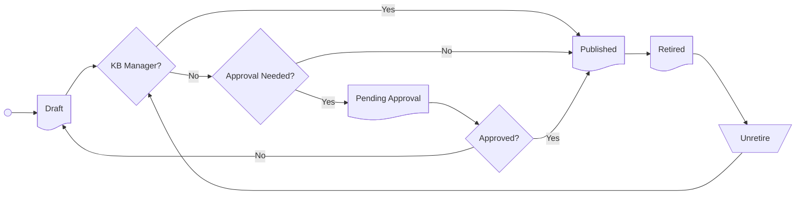

# Configuration
In the Articles Configuration view, you can work with the Article Editor as well as update the article's details such as its knowledge base, topic, article type, and tags. You can also create translations of the article.

## Article
This section includes the main editor that is used for creating and updating the main content of the article. In addition, here you can change some of the article's details.

### Article Editor
* Toolbar
* Section context formatter

## Details
The Details section contains key information about the article. The settings and controls for the article can all be found here.
* **Id.** A unique ID for the article. This cannot be changed.
* **Default Language.** The language that the article was created in. This cannot be changed.  
* **Title.** Displayed in many of the lists and within the structure of the associated knowledge base. Because this title is important when users search for knowledge content, make sure to use a title that represents the article's information in a way that helps users find the article.
* **Owned By.** This is automatically set using the name of the person who created the article. Both the current owner and the knowledge base manager can change the owner.
* **Status.** This changes when actions are taken on an article.  
* **Date Published.** The date when the article initially changed from draft to published.
* **Knowledge Base.** This is the article's current knowledge base.  If you wish to transfer this to a different knowledge base, you can choose from the list of existing knowledge bases.  When changing the knowledge base, you will also need to change the topic.
* **Topic.** Signifies where the article is located in the topic tree, which can be seen when browsing the knowledge base.
* **Knowledge Base Article Type.** The selected article type can be used for filtering.
* **External Reference.** A free-text field to record an external reference number for the article.
* **External Source.** A free-text field to record an external source for the article.
* **Visible In Employee Portal.** Provided that the knowledge base has been set to be visible in the Employee Portal, turning this setting off hides the article in this portal.
* **Visible In Customer Portal.** Provided that the knowledge base has been set to be visible in the Customer Portal, turning this off hides the article in this portal.
* **Created By.** The original creator of the article.
* **Last Modified By.** The last person to modify the article.  

## Translations
Here you can add and view translations for the article.

## Article status lifecycle
Each article will work through several statuses throughout its life.  

* **Draft**. An article that has the status of draft is not visible to users when browsing or searching a knowledge base.  All new articles will start with the draft status.
* **Pending Approval**. Where approval is required, a contributor will need to submit a draft article to be approved by a knowledge manager before it is published. When approved, the status will automatically change to published.
* **Published**. Published articles are available to users when browsing and searching a knowledge base.
* **Retired**. When an article is no longer relevant, the status can be set to retired.  Retired articles are no longer available for users to browse or search. A retired article can be unretired.  When unretired by a knowledge manager, the status will change to being published.  When unretired by a contributor and the approval to publish articles is enabled, the article will need to be approved by a knowledge base manager before the status is set to published.  The option to `unretire` can be found on the details section of an article.

:::note
At any point within the lifecycle, an article can be deleted.  This action cannot be reversed.  Deleting will permanently remove the article.
:::