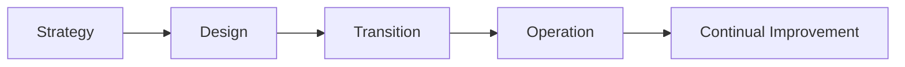

# Service Portfolio Overview

The Service Portfolio provides features and configuration for defining business services offered to employees and customers and the technical services that underpin these business services.

The portfolio consists of services in various stages, ranging from pipeline to retirement. These services can be defined, planned, delivered, and reviewed to ensure continual improvement.

## Before you begin

* Users must have the [Services Manager Role](/servicemanager-config/setup/service-manager-roles#services) to access the Service Portfolio and to create and manage services.

## Service visibility

When viewing the service portfolio, the services displayed in the list are limited by ownership and by the membership of the [teams that support the service](/servicemanager-user-guide/service-portfolio/services/overview#supporting-teams).

* **Service owner**. The [service owner](/servicemanager-user-guide/service-portfolio/services/overview#owner) can see all the services they own.
* **A service without dedicated supporting teams**. A user with the *[Services Manager](/servicemanager-config/setup/service-manager-roles#services)* role can see any service that doesn't have dedicated [support teams](/servicemanager-user-guide/service-portfolio/services/overview#supporting-teams).
* **A service with one or more dedicated supporting teams**. A user with the *[Services Manager](/servicemanager-config/setup/service-manager-roles#services)* role can only see the services where they are a member of one of the dedicated [support teams](/servicemanager-user-guide/service-portfolio/services/overview#supporting-teams) for that service.

This allows for some control over visibility of services that may contain sensitive information.

## Service Catalog

The Service Catalog is a sub-set of services in the service portfolio that are active and available for employees and customers to consume. The [service status](/servicemanager-user-guide/service-portfolio/services/service-availability) can be changed to `Catalog` to make a service available. These services can be accessed through the [Customer Portal](/esp-config/customize/customer-portal/configure-customer-portal) and the [Employee Portal](/esp-config/customize/employee-portal/employee-portal-configuration).

## Service Portfolio Trends

Three charts help to identify trends with your services.  These charts are available by clicking on the tool bar option for each trend.

* **Service Desmand**. Select up to five services to compare the number of requests made to to each service per month.

* **Service Availability**.  Select up to five services to compare which services have experienced the most time spent as impacted and unavailable.

* **Service Subscriptions**. Select up to five services to compare the number of service subscriptions.
