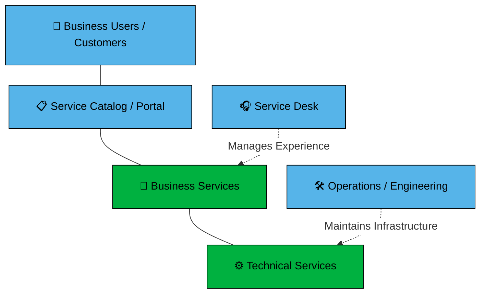

# Service overview

Services connect technical capabilities to business value. They use a clear hierarchy to help with delivery and support. A service is primarily used to group and manage requests, but it also provides a way to organize the underlying assets and other services that support it. Services are the foundation of your service portfolio, and they help you understand how everything fits together.

## Planning a service

When planning a service, it’s important to follow a structured approach to ensure that the service meets the needs of its users and is sustainable in the long term. Here are the key steps to consider:

1. **Figure out the "Why".** Before building anything, make sure people actually need it.
    * **Who is it for?** Identify your specific "customers".
    * **What problem does it solve?** Make sure the service makes their life easier.
    * **Can we afford it?** Check if you have the budget for the tools and the people to run it long-term.
1. **Design the "How".** Decide exactly how the service will work day-to-day.
    * **The "4 Ps"**: Plan for the People (who runs it), Products (the software/tools), Partners (outside vendors), and Processes (the step-by-step instructions).
    * **Set the "Promises"**: Agree on how fast it should be and how often it’s allowed to be "down" for maintenance.
    * **Quality Check**: Make sure that all aspects of the service are working and that the demand for the service can be met.
1. **Plan the Handover**. Make sure the team is ready to support the users once it goes live.
    * **The Help Plan**: Who does a user call when it breaks? Create a simple path for getting help.
    * **The "Success" Test**: Decide now how you'll know if the service is a hit. Is it based on how many people use it, or how happy they are?

## Service types

There are two main types of services in an ITSM framework:

* **Business Services**: These represent the value you see and use every day, such as email or payroll. You can access these through the Service Catalog.
* **Technical Services**: These provide the underlying infrastructure that makes Business Services possible. Examples include servers and networks.

## Support teams

A dual-support model maintains the service ecosystem:

* **Service Desk**: This team manages your experience and handles business relationships.
* **Operations and Engineering**: These teams maintain the technical health of the stack. They ensure every service remains reliable and meets your needs.

The Supporting Teams feature allows you to assign dedicated service desk teams to a specific service. This ensures that the right people manage the correct requests.

### How team access works

Access to service requests depends on whether you have assigned a team to the service:

* **Default access**: When you create a new service, all service desk teams support it. Every team can view and manage the requests for that service.
* **Restricted access**: When you assign one or more dedicated teams to a service, the system limits access. Only the assigned teams can see and manage the requests for that service.

### Supporting team capabilities

Members of a supporting team on a service can perform the following:

* **View requests**: You can see the requests raised against your service. Role assignments will determine the types of request you can see.
* **Request assignment**: You can be assigned requests that are associated with the service and reassign requests to other supporting team members.
* **Search for requests**: You can use the global search bar to find specific information. The search results will include requests logged against services your team supports, requests assigned to you or your team, and requests where you are a member.

## Service subscriptions

Business users and customers subscribe to the service to use its features. You can manage these subscriptions for your users to ensure they have the access they need.

You can subscribe customers to a service based on specific organization groups. By default, the subscription settings allow all customers to use the service.

:::tip
Only groups that contain users will be displayed.
:::

### Subscribing sub-groups

By default, each organizational grouping needs to be added individually to a service for its members to be subscribed to the service. If your organizational structure utilizes sub-groups linked to a parent group --- for example, departments under a company grouping, and the members of each department are listed under the relevant department but not also in the company grouping --- you may want to subscribe all the departments and therefore all the members by simply subscribing the parent company grouping. To facilitate this approach you can do the following:

To allow for subscribing of sub-groups, Hornbill administrators can turn on the `com.hornbill.servicemanager.services.subscriptions.allowSubgroupsInclusion` setting, which is off by default.

This enables users to subscribe sub-groups to a service based on the parent grouping being subscribed.

::: note
This will NOT automatically apply to existing group subscriptions and new group subscriptions.

With this setting enabled, you can choose to allow sub-group subscriptions when applying new group subscriptions and managing existing group subscriptions.
:::

When subscribing a new organizational grouping to a service, or managing an existing organizational group subscription to a service, a Sub-Grouping icon will now be visible. By default, this is disabled.

**To enable sub-group subscriptions:**

1. To subscribe all members of the sub-groups to the service based on the parent group's subscription, click the Sub-Grouping icon to enable the setting.
1. (Optional) To disable subgroups and their members' subscription to the service based on the parent group subscription, click the Sub-Grouping icon to disable it.

The sub-group option will not apply to non-organizational-based groupings such as sites, users, and contacts.

Catalog item visibility in the request catalog for sub-group members subscribed via their parent organizational grouping respects the parent's inclusion or exclusion of each catalog item's visibility.

## Portal Visibility

If the Service will be visible on the Employee and Customer portals for subscribed users.

* **Visible:** Subscribed users will see, and have access to their requests raised against the Service, even if they you have restricted their ability to raise tickets from the portals for this Service.
* **Hidden:** Subscribed users will not see the Service on the Customer or Service portal - Useful when defining a technical Service rather than a business Service.

## Owner

Each Service requires an owner.  When a service is first created, it automatically allocates the creator of the service as the owner.

* Only the owner can change the owner to another user.
* Only the owner can change the Service Access option between `Private` and `Open`.
* When selecting a new owner, only users that have the *[Services Manager](/servicemanager-config/setup/service-manager-roles#services)* role will be available

## Service Access

The Service Access option allows the owner of a service to control who can modify the service details and configuration by using the options `Open` or `Private`.

* **Open:** Users with the *Services Manager* role who have [visibility of the service](/servicemanager-user-guide/service-portfolio/overview#service-visibility) can update and manage the details and configuration, excluding the ability to change the owner and the service access option.
* **Private:** Users with the *Services Manager* role who have [visibility of the service](/servicemanager-user-guide/service-portfolio/overview#service-visibility) are limited from making configuration changes. They can only add and update FAQs, bulletins, and the operational status. This allows a service owner to maintain full control of the service.

:::tip
A user that is a member of a team that support the service, but doesn't have the *Services Manager* role, will have limited access to the details of the service when accessed from a request or the request list. They can update FAQs, bulletins, and the operational status.
:::

## Activities

The Activities panel lets you create and managed tasks and activities against this service. This can be used for planning updates to any aspect of the service such as updating a workflow or Intelligent Capture.

## Timeline

Each service provides an area where users who have access to the service can have a discussion about the service. This is a great way to plan or make suggestions for the service.

## Requests

The Requests list provides a view of all the requests that have been raised and associated with the service.

* **Direct Requests**. The list provided under Direct Requests are requests where the selected service is the primary service for the request.
* **Associated Requests**. The associated requests consist of requests that have had this service selected as a [linked service](/servicemanager-user-guide/service-portfolio/requests/linked-services-action).

## Assets

Associating the assets which support a service helps support quicker Incident and or Problem resolutions by making it quick and easy to understand what infrastructure is directly used to provide each service. Change management can benefit from visualizing impact when considering implementing changes to a service, or assets which support a service.

## Services

Associating services that support or underpin other services can help support incident and or problem resolutions by making it quick and easy to understand how services are related and if there are any dependencies between them. Change management can benefit from visualizing impact when considering implementing changes to a service.
